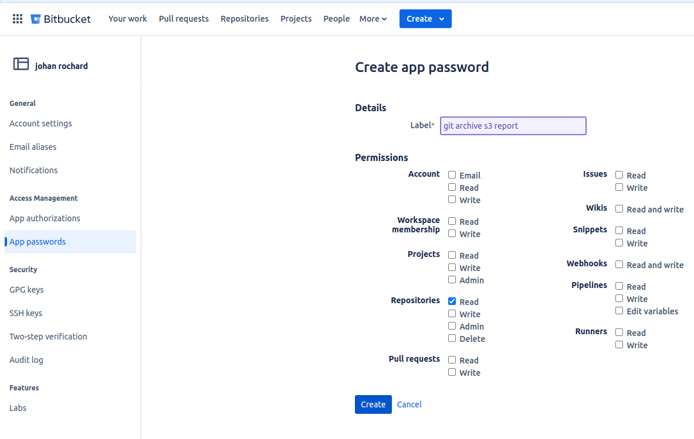

# Git Archive S3 Report

Tool to backup and analyze Bitbucket repositories. Features include cloning repositories, generating Excel reports, creating zip archives, and uploading to Amazon S3.

## Installation

### 1. Prerequisites
- Go 1.22 or higher (https://golang.org/dl/)
- A Bitbucket account with API access
- AWS credentials (if using S3 upload feature)

### 1.1 Generate Bitbucket Token


### Installation Steps

1. Clone and build the project:
```bash
# Get the code
git clone https://github.com/s3pweb/gitArchiveS3Report.git
cd gitArchiveS3Report

# Install dependencies and build
go mod tidy
go build -o git-archive-s3
```

2. Install ghorg:
https://github.com/gabrie30/ghorg?tab=readme-ov-file#installation

```bash
# Verify ghorg installation
which ghorg
```

### Configuration

1. Create and configure the `.env` file:
```bash
# Copy example file
cp example.env .env
```

2. Edit the `.env` file with your settings:
```bash
# Bitbucket Configuration
BITBUCKET_TOKEN=your_token
BITBUCKET_USERNAME=your_username
BITBUCKET_WORKSPACE=your_workspace

# AWS Configuration (Optional: For S3 upload feature)
AWS_ACCESS_KEY_ID=your_aws_key
AWS_SECRET_ACCESS_KEY=your_aws_secret
AWS_REGION=your_aws_region
AWS_BUCKET_NAME=your_bucket_name
AWS_UPLOAD_KEY=your_upload_prefix

# Logger Configuration
LOG_LEVEL=debug

# Application Configuration
# The number of CPU cores to use for cloning repositories
CPU=1

# Developer name mappings (optional)
# Format: alias1=Real Name 1;alias2=Real Name 2
DEVELOPERS_MAP=john=John Doe;jane=Jane Smith

# Default columns for the Excel report
DEFAULT_COLUMN=RepoName;BranchName;LastCommitDate;TimeSinceLastCommit;Commitnbr;HostLine;LastDeveloper;LastDeveloperPercentage

# Search terms and files for analysis
TERMS_TO_SEARCH=vault;swagger
FILES_TO_SEARCH=(?i)sonar-project.properties$;(?i)bitbucket-pipelines.yml$;(?i)Dockerfile$;(?i)docker-compose(-\w+)?\.yaml$

# Default clone directory
DIR=./repositories

## Explanation of FILES_TO_SEARCH regex patterns:
- `(?i)`: Case-insensitive matching
- `$`: End of the string

### Examples
- `(?i)sonar-project.properties$`
  - Matches: `sonar-project.properties`, `Sonar-Project.Properties`
  - Does not match: `sonar-project.properties.txt`, `my-sonar-project.properties`
- `(?i)docker-compose(-\w+)?\.yaml$`
  - Matches: `docker-compose.yaml`, `docker-compose-test.yaml`
  - Does not match: `docker-compose.yaml.backup`
```

## Usage

### Display Available Commands
```bash
./git-archive-s3
```

### Clone Repositories
```bash
./git-archive-s3 clone [flags]
  -p, --dir-path string   Directory for cloned repositories (default: ./repositories) (optional)
  -m, --main-only         Clone only main/master/develop branches (optional)
  -s, --shallow           Perform shallow clone (latest commit only) (optional)
```

### Generate Report
```bash
./git-archive-s3 report [flags]
  -p, --dir-path string   Path to repositories directory (optional)
  -d, --dev-sheets        Generate developer-specific sheets (optional)
```

### Create ZIP Archives
```bash
./git-archive-s3 zip [flags]
  -p, --dir-path string   Path to repositories directory (required)
```

### Upload to S3
```bash
./git-archive-s3 upload [flags]
  -p, --dir-path string   Path to directory to upload (required)
```

## Notes
- All configuration is now centralized in a single `.env` file
- Environment variables can be used to override any setting from the `.env` file
- The DEVELOPERS_MAP feature allows you to map developer usernames to their full names in the report
- When using --main-only (-m), only the main branch (main, master, or develop if neither exists) will be cloned
- The report reflects the state of the cloned repositories, so if you clone with --main-only, the report will only show the main branches